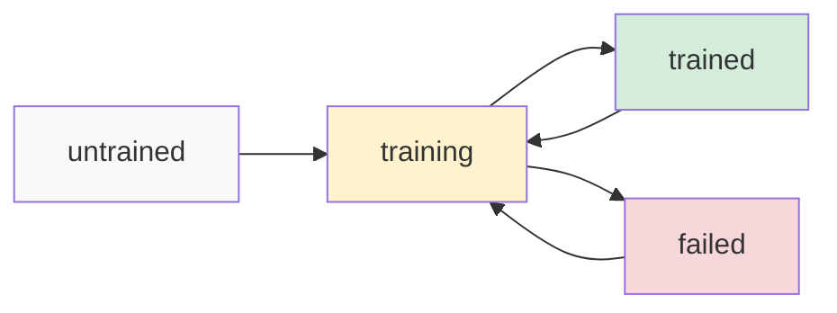

# Person Management

Manage people in your photo collection with comprehensive person identification and organization features.

## Person Operations

### `GET /api/persons`
**Description**: Get all persons with face thumbnails and statistics

**Response**:
```json
{
  "persons": [
    {
      "id": 1,
      "name": "John Doe",
      "notes": "Family member",
      "face_count": 25,
      "sample_face_image": "/processed/faces/john_face_1.jpg",
      "recognition_status": "trained",
      "auto_recognize": true,
      "created_at": "2023-01-01T12:00:00Z",
      "last_trained_at": "2023-06-15T10:30:00Z"
    }
  ],
  "total": 10,
  "statistics": {
    "total_persons": 10,
    "trained_persons": 8,
    "untrained_persons": 2
  }
}
```

### `GET /api/persons/:id`
**Description**: Get person by ID with all associated faces

**Path Parameters**:
- `id` (number): Person ID

**Example Request**:
```bash
curl http://localhost:9000/api/persons/1
```

**Response**:
```json
{
  "person": {
    "id": 1,
    "name": "John Doe",
    "notes": "Family member",
    "face_count": 25,
    "recognition_status": "trained",
    "training_face_count": 20,
    "faces": [
      {
        "id": 1,
        "face_image_path": "/processed/faces/john_face_1.jpg",
        "confidence": 0.95,
        "image_id": 100,
        "detection_confidence": 0.98,
        "assigned_at": "2023-06-01T12:00:00Z"
      }
    ]
  }
}
```

### `POST /api/persons`
**Description**: Create new person

**Request Body**:
```json
{
  "name": "Jane Smith",
  "notes": "Optional notes about the person",
  "auto_recognize": true
}
```

**Response**:
```json
{
  "person": {
    "id": 2,
    "name": "Jane Smith",
    "notes": "Optional notes about the person",
    "face_count": 0,
    "recognition_status": "untrained",
    "auto_recognize": true,
    "created_at": "2023-06-17T12:00:00Z"
  }
}
```

### `PUT /api/persons/:id`
**Description**: Update person information

**Path Parameters**:
- `id` (number): Person ID

**Request Body**:
```json
{
  "name": "Updated Name",
  "notes": "Updated notes",
  "auto_recognize": false,
  "recognition_status": "trained"
}
```

**Response**:
```json
{
  "person": {
    "id": 1,
    "name": "Updated Name",
    "notes": "Updated notes",
    "auto_recognize": false,
    "updated_at": "2023-06-17T12:00:00Z"
  }
}
```

### `DELETE /api/persons/:id`
**Description**: Delete person (unassigns all faces, doesn't delete face images)

**Path Parameters**:
- `id` (number): Person ID

**Response**:
```json
{
  "message": "Person deleted successfully",
  "faces_unassigned": 25
}
```

## Training Management

### `GET /api/persons/:id/training-history`
**Description**: Get training history for a person

**Path Parameters**:
- `id` (number): Person ID

**Response**:
```json
{
  "person": {
    "id": 1,
    "name": "John Doe",
    "recognition_status": "trained"
  },
  "trainingHistory": [
    {
      "id": 1,
      "training_type": "full",
      "status": "completed",
      "faces_trained_count": 15,
      "started_at": "2023-06-01T10:00:00Z",
      "completed_at": "2023-06-01T10:05:00Z",
      "success_rate": 95.5
    }
  ]
}
```

### `POST /api/persons/:id/train`
**Description**: Start manual training for a person

**Path Parameters**:
- `id` (number): Person ID

**Request Body**:
```json
{
  "trainingType": "incremental"
}
```

**Response**:
```json
{
  "message": "Training started",
  "person": {
    "id": 1,
    "recognition_status": "training"
  },
  "trainingId": 5
}
```

## Person Features

import Tabs from '@theme/Tabs';
import TabItem from '@theme/TabItem';

<Tabs>
  <TabItem value="management" label="👥 Management" default>
    - **Person Creation** - Add new people to identify
    - **Bulk Operations** - Manage multiple people efficiently
    - **Notes & Metadata** - Add context and relationships
    - **Status Tracking** - Monitor training and recognition states
  </TabItem>
  <TabItem value="recognition" label="🎯 Recognition">
    - **Auto Recognition** - Automatic face identification
    - **Training Management** - Improve recognition accuracy
    - **Confidence Scoring** - Quality assessment
    - **Manual Override** - Correct misidentifications
  </TabItem>
  <TabItem value="organization" label="📁 Organization">
    - **Face Galleries** - View all faces for each person
    - **Statistics** - Face counts and training metrics
    - **Search Integration** - Find photos by person
    - **Relationship Mapping** - Family and friend connections
  </TabItem>
</Tabs>

## Recognition Status States

### Status Lifecycle


**Status Descriptions**:
- **untrained** - Person exists but no training data available
- **training** - Currently being trained with CompreFace
- **trained** - Successfully trained and available for recognition
- **failed** - Training failed, needs manual intervention

## Common Use Cases

### Create Person and Start Training
```bash
# 1. Create person
curl -X POST http://localhost:9000/api/persons \
  -H "Content-Type: application/json" \
  -d '{"name": "Alice Johnson", "auto_recognize": true}'

# 2. Assign faces manually (see Face Recognition API)
# 3. Start training when enough faces are assigned
curl -X POST http://localhost:9000/api/persons/3/train \
  -H "Content-Type: application/json" \
  -d '{"trainingType": "full"}'
```

### Update Person Preferences
```bash
# Disable auto-recognition for a person
curl -X PUT http://localhost:9000/api/persons/1 \
  -H "Content-Type: application/json" \
  -d '{"auto_recognize": false}'
```

### View Person Statistics
```bash
# Get comprehensive person info
curl http://localhost:9000/api/persons/1
```

## Validation Rules

### Person Creation
- **Name**: Required, 1-200 characters
- **Notes**: Optional, max 1000 characters
- **Auto Recognize**: Boolean, defaults to `true`

### Person Updates
- **Name**: Must be unique among all persons
- **Recognition Status**: Can only be updated through training operations
- **Training Count**: Read-only, updated automatically

## Error Responses

### Person Not Found
```json
{
  "error": "Person not found",
  "code": "NOT_FOUND",
  "details": {
    "person_id": 999
  }
}
```

### Duplicate Name
```json
{
  "error": "Person name already exists",
  "code": "ALREADY_EXISTS",
  "details": {
    "name": "John Doe",
    "existing_person_id": 1
  }
}
```

### Training Requirements Not Met
```json
{
  "error": "Insufficient faces for training",
  "code": "INSUFFICIENT_DATA",
  "details": {
    "current_faces": 2,
    "minimum_required": 3,
    "suggestion": "Assign more faces before training"
  }
}
```

## Best Practices

:::tip Person Management Tips
- **Names**: Use full names for better organization
- **Training**: Assign 5-10 high-quality faces before training
- **Notes**: Add relationship info ("father", "colleague", etc.)
- **Auto Recognition**: Disable for people you rarely want to identify
:::

### Training Guidelines
1. **Quality over Quantity** - Use clear, well-lit face images
2. **Variety** - Include different angles and expressions
3. **Regular Updates** - Retrain as more faces are identified
4. **Monitoring** - Check training status and success rates