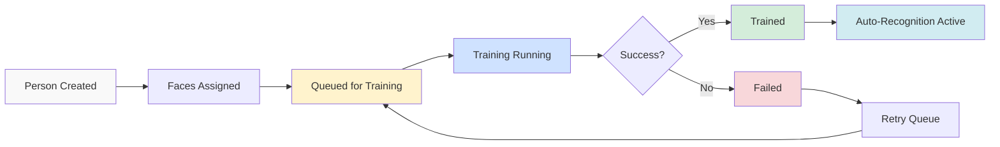

# Training Management

Manage CompreFace face recognition model training to improve person identification accuracy.

## Overview

The Training Management system handles the process of training CompreFace's face recognition models with face examples for each person. This is critical for improving recognition accuracy over time.

### Training Purpose

- **Model Learning** - Teach CompreFace to recognize specific people
- **Accuracy Improvement** - More training examples = better recognition
- **Continuous Learning** - Retrain as new faces are identified
- **Performance Monitoring** - Track training success and recognition confidence

## Training Queue Operations

### `POST /api/persons/:id/queue-training`
**Description**: Queue a person for CompreFace training

**Path Parameters**:
- `id` (number): Person ID

**Request Body**:
```json
{
  "trainingType": "full",
  "config": {
    "minFacesThreshold": 3,
    "maxFacesPerBatch": 50
  }
}
```

**Training Types**:
- `full` - Complete retraining with all faces
- `incremental` - Add new faces to existing model
- `validation` - Test training effectiveness

**Response**:
```json
{
  "success": true,
  "message": "Person queued for training",
  "trainingId": 1
}
```

### `POST /api/training/process-queue`
**Description**: Process all pending training jobs

**Request Body**:
```json
{
  "config": {
    "maxConcurrentJobs": 5
  }
}
```

**Response**:
```json
{
  "success": true,
  "message": "Processed 3 training jobs",
  "results": [
    {
      "id": 1,
      "person_id": 5,
      "person_name": "John Doe",
      "status": "completed",
      "faces_added": 15,
      "success_rate": 100,
      "training_time": 5200
    }
  ]
}
```

### `GET /api/training/queue`
**Description**: Get current training queue status

**Response**:
```json
{
  "success": true,
  "queue": {
    "pendingJobs": [
      {
        "id": 2,
        "person_id": 10,
        "person_name": "Jane Smith",
        "training_type": "incremental",
        "status": "pending",
        "faces_trained_count": 8,
        "started_at": "2023-06-17T10:00:00Z"
      }
    ],
    "runningJobs": [],
    "completedJobs": [
      {
        "id": 1,
        "person_name": "John Doe",
        "status": "completed",
        "faces_trained_count": 15,
        "success_rate": 100,
        "completed_at": "2023-06-17T09:55:00Z"
      }
    ],
    "totalPeople": 25,
    "trainedPeople": 10,
    "untrainedPeople": 15
  }
}
```

## Automatic Training

### `POST /api/training/auto-train`
**Description**: Automatically queue eligible people for training

**Request Body**:
```json
{
  "config": {
    "enabled": true,
    "minFacesThreshold": 3,
    "trainingInterval": 6,
    "autoRetryFailures": true,
    "maxRetries": 3
  }
}
```

**Auto-Training Criteria**:
- People with >= `minFacesThreshold` faces
- Not trained within `trainingInterval` hours
- Failed training jobs if `autoRetryFailures` is true

**Response**:
```json
{
  "success": true,
  "message": "Auto-queued 5 people for training",
  "queuedJobs": [
    {
      "id": 3,
      "person_id": 5,
      "person_name": "John Doe",
      "training_type": "full",
      "status": "pending",
      "reason": "Never trained before"
    }
  ]
}
```

## Training Statistics

### `GET /api/training/stats`
**Description**: Get comprehensive training statistics

**Response**:
```json
{
  "success": true,
  "stats": {
    "totalPeople": 25,
    "trainedPeople": 10,
    "untrainedPeople": 15,
    "trainingJobs": 50,
    "averageTrainingTime": 4500,
    "successRate": 95.5,
    "lastTrainingDate": "2023-06-17T10:30:00Z",
    "breakdown": {
      "successful": 48,
      "failed": 2,
      "pending": 0,
      "running": 0
    }
  }
}
```

## Job Management

### `DELETE /api/training/jobs/:jobId`
**Description**: Cancel a training job

**Path Parameters**:
- `jobId` (number): Training job ID

**Response**:
```json
{
  "success": true,
  "message": "Training job cancelled"
}
```

### `POST /api/training/jobs/:jobId/retry`
**Description**: Retry a failed training job

**Path Parameters**:
- `jobId` (number): Failed training job ID

**Response**:
```json
{
  "success": true,
  "message": "Training job retried",
  "newJobId": 15
}
```

### `POST /api/training/cleanup`
**Description**: Clean up old training history

**Request Body**:
```json
{
  "daysToKeep": 30
}
```

**Response**:
```json
{
  "success": true,
  "message": "Cleaned up 50 old training history records",
  "deleted": 50
}
```

## Training Workflow

import Tabs from '@theme/Tabs';
import TabItem from '@theme/TabItem';

<Tabs>
  <TabItem value="preparation" label="📋 Preparation" default>
    **Before Training:**
    - Person must have assigned faces
    - Minimum 3 faces recommended
    - Face images must be accessible
    - CompreFace service must be running
  </TabItem>
  <TabItem value="process" label="⚙️ Process">
    **Training Steps:**
    1. Collect assigned face images
    2. Upload faces to CompreFace
    3. Update person's CompreFace subject
    4. Track progress and errors
    5. Update training status
  </TabItem>
  <TabItem value="results" label="📊 Results">
    **After Training:**
    - Person marked as "trained"
    - Face count recorded
    - Success rate calculated
    - Auto-recognition enabled
    - History logged for tracking
  </TabItem>
</Tabs>

## Training Status Flow



## Best Practices

:::tip Training Guidelines
- **Face Quality** - Use clear, well-lit face images
- **Face Quantity** - 5-10 faces per person for good results
- **Face Variety** - Different angles, expressions, and lighting
- **Regular Updates** - Retrain as new faces are added
- **Monitor Performance** - Check success rates and confidence scores
:::

### Optimal Training Configuration
```json
{
  "minFacesThreshold": 5,      // Minimum faces before training
  "maxFacesPerBatch": 50,      // Batch size for uploads
  "trainingInterval": 24,       // Hours between retraining
  "autoRetryFailures": true,    // Retry failed jobs
  "maxRetries": 3              // Maximum retry attempts
}
```

## Common Issues

### Insufficient Faces
```json
{
  "error": "Person needs at least 3 faces for training",
  "code": "INSUFFICIENT_DATA",
  "details": {
    "person_id": 5,
    "current_faces": 2,
    "minimum_required": 3
  }
}
```

### CompreFace Connection Error
```json
{
  "error": "Failed to connect to CompreFace service",
  "code": "EXTERNAL_SERVICE_ERROR",
  "details": {
    "service": "CompreFace",
    "url": "http://compreface-ui:80",
    "suggestion": "Check if CompreFace is running"
  }
}
```

### Training Already Running
```json
{
  "error": "Training already in progress for this person",
  "code": "ALREADY_EXISTS",
  "details": {
    "person_id": 5,
    "existing_job_id": 10,
    "status": "running"
  }
}
```

## Performance Metrics

### Success Indicators
- **High Success Rate** (>90%) - Good face quality and quantity
- **Fast Training Time** (less than 5s) - Efficient processing
- **Low Retry Rate** (less than 10%) - Stable system performance

### Warning Signs
- **Low Success Rate** (less than 70%) - Poor face quality or system issues
- **Slow Training** (more than 30s) - Performance bottleneck
- **High Failure Rate** (more than 20%) - System or data problems

## Integration with Face Recognition

After successful training:

1. **Auto-Recognition** - Person automatically identified in new photos
2. **Confidence Scoring** - Higher confidence in recognition results
3. **Continuous Learning** - New faces improve future recognition
4. **Performance Tracking** - Monitor recognition accuracy over time