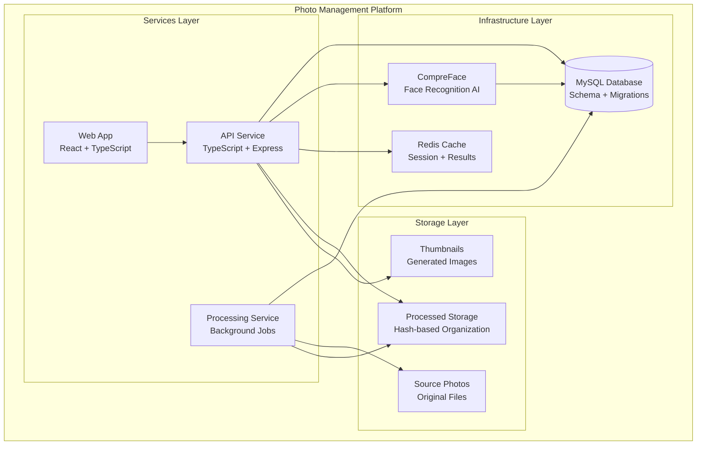
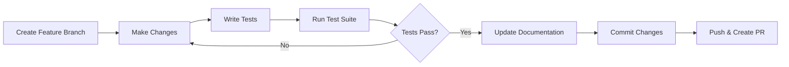

# Development Setup

Set up a complete development environment for contributing to the Photo Management Platform.

## 🏗️ Platform Architecture

Understanding the platform architecture helps with development:



## 🛠️ Prerequisites

Before starting development, ensure you have these tools:

import Tabs from '@theme/Tabs';
import TabItem from '@theme/TabItem';

<Tabs>
  <TabItem value="required" label="✅ Required" default>
    - **Node.js 18+** - JavaScript runtime
    - **Docker & Docker Compose** - Container orchestration
    - **Git** - Version control
    - **TypeScript** - Type-safe development
  </TabItem>
  <TabItem value="recommended" label="🌟 Recommended">
    - **VS Code** - IDE with excellent TypeScript support
    - **Thunder Client** - API testing (VS Code extension)
    - **MySQL Workbench** - Database visualization
    - **Postman** - Alternative API testing
  </TabItem>
  <TabItem value="optional" label="⚡ Optional">
    - **Jest Runner** - VS Code extension for testing
    - **GitLens** - Enhanced Git integration
    - **Docker Desktop** - GUI for container management
    - **npm-check-updates** - Dependency management
  </TabItem>
</Tabs>

## 🚀 Quick Development Setup

### 1. Clone and Install

```bash
# Clone the repository
git clone <repository-url>
cd photo-process

# Install root dependencies
npm install

# Install service dependencies
cd services/api && npm install && cd ../..
```

### 2. Environment Configuration

```bash
# Run automated setup
npm run dev:setup

# Copy environment template
cp .env.example .env
```

:::warning Configure Development Environment
Edit `.env` for development:
```bash
# Development Database
MYSQL_HOST=localhost
MYSQL_PORT=3307
MYSQL_PASSWORD=dev-password

# Development Storage (use test directories)
MEDIA_SOURCE_DIR=./dev-source
MEDIA_PROCESSED_DIR=./dev-processed
MEDIA_LOGS_DIR=./dev-logs

# CompreFace (development instance)
COMPREFACE_URL=http://localhost:8001
```
:::

### 3. Start Development Environment

```bash
# Start all development services
npm run dev

# This starts:
# - MySQL database (port 3307)
# - CompreFace AI service (port 8001)  
# - API service (port 9000)
# - Documentation site (port 3000)
```

### 4. Initialize Development Database

```bash
# Run database migrations
npm run db:migrate

# Seed with development data
npm run db:seed

# Verify database setup
npm run db:status
```

### 5. Development Verification

<Tabs>
  <TabItem value="api" label="🔗 API Service" default>
    ```bash
    # Test API health
    curl http://localhost:9000/api/health
    
    # Test database connection
    curl http://localhost:9000/api/database/status
    
    # Get sample data
    curl http://localhost:9000/api/persons
    ```
  </TabItem>
  <TabItem value="tests" label="🧪 Test Suite">
    ```bash
    # Run all tests
    npm run test:unit
    
    # Run tests in watch mode
    npm run test:watch
    
    # Generate coverage report
    npm run test:coverage
    ```
  </TabItem>
  <TabItem value="docs" label="📚 Documentation">
    ```bash
    # Start documentation site
    cd docs-site && npm start
    
    # Visit: http://localhost:3000
    ```
  </TabItem>
</Tabs>

## 📁 Development Workflow

### Project Structure

```
photo-process/
├── services/
│   ├── api/                 # Main API service
│   │   ├── routes/         # API endpoints
│   │   ├── util/           # Business logic
│   │   ├── models/         # Database models
│   │   └── tests/          # API tests
│   ├── mobile-app/         # React Native mobile app
│   ├── processing/         # Background processing
│   └── web-app/           # React frontend
├── infrastructure/
│   ├── database/          # MySQL setup & migrations
│   └── compreface/        # Face recognition service
├── platform-tools/       # Development utilities
├── platform-tests/       # Integration tests
└── docs-site/            # Documentation website
```

### Development Commands

<Tabs>
  <TabItem value="api" label="🔧 API Development" default>
    ```bash
    # API service development
    cd services/api
    
    # Start API in development mode
    npm run dev
    
    # Run TypeScript compilation
    npm run build
    
    # Run API tests
    npm run test
    
    # Lint and format code
    npm run lint
    npm run format
    ```
  </TabItem>
  <TabItem value="database" label="🗄️ Database Development">
    ```bash
    # Database management
    npm run db:migrate         # Run migrations
    npm run db:rollback        # Rollback last migration
    npm run db:seed           # Run seeds
    npm run db:reset          # Reset database
    
    # Create new migration
    npm run db:create-migration -- add_new_feature
    
    # Create new seed
    npm run db:create-seed -- sample_data
    ```
  </TabItem>
  <TabItem value="testing" label="🧪 Testing">
    ```bash
    # Unit tests
    npm run test:unit
    npm run test:unit:watch
    
    # Integration tests  
    npm run test:integration
    
    # API testing tools
    npm run test:single-file
    npm run test:full-processing
    npm run test:object-detection
    ```
  </TabItem>
  <TabItem value="mobile" label="📱 Mobile App">
    ```bash
    # Mobile app development (requires Mac for iOS)
    cd services/mobile-app
    
    # Sync code to Mac for development
    ./sync-to-mac.sh
    
    # On Mac: Start Expo development server
    npx expo start
    
    # Test mobile API integration
    curl http://LINUX_IP:9000/api/gallery?limit=1
    ```
  </TabItem>
</Tabs>

## 🔄 Development Workflow

### Making Changes



### Branch Strategy

:::tip Git Workflow
- **main** - Production-ready code
- **feature/feature-name** - New features
- **bugfix/issue-description** - Bug fixes
- **docs/topic** - Documentation updates
:::

```bash
# Create feature branch
git checkout -b feature/smart-album-improvements

# Make your changes
# ... edit files ...

# Run tests
npm run test:unit

# Commit with descriptive message
git commit -m "feat: improve smart album generation algorithm

- Add confidence scoring for object detection
- Implement time-based clustering
- Add tests for new album types"

# Push and create PR
git push origin feature/smart-album-improvements
```

### Code Standards

<Tabs>
  <TabItem value="typescript" label="📝 TypeScript" default>
    ```typescript
    // Use explicit types
    interface PhotoMetadata {
      id: number;
      filename: string;
      dateTaken?: Date;
      camera?: string;
    }
    
    // Prefer async/await over promises
    async function processPhoto(id: number): Promise<PhotoMetadata> {
      const photo = await db.photos.findById(id);
      return {
        id: photo.id,
        filename: photo.filename,
        dateTaken: photo.date_taken,
        camera: photo.camera_model
      };
    }
    ```
  </TabItem>
  <TabItem value="testing" label="🧪 Testing Standards">
    ```typescript
    // Write descriptive test names
    describe('Photo Processing Service', () => {
      test('should extract EXIF data from JPEG files', async () => {
        // Arrange
        const testPhoto = createMockPhoto();
        
        // Act
        const metadata = await extractExifData(testPhoto);
        
        // Assert
        expect(metadata.camera).toBe('iPhone 13');
        expect(metadata.dateTaken).toBeInstanceOf(Date);
      });
    });
    ```
  </TabItem>
  <TabItem value="api" label="🔗 API Standards">
    ```typescript
    // Consistent error handling
    app.get('/api/photos/:id', async (req, res) => {
      try {
        const photo = await photoService.getById(req.params.id);
        if (!photo) {
          return res.status(404).json({ error: 'Photo not found' });
        }
        res.json(photo);
      } catch (error) {
        logger.error('Failed to get photo', error);
        res.status(500).json({ error: 'Internal server error' });
      }
    });
    ```
  </TabItem>
</Tabs>

## 🐛 Debugging

### Common Development Issues

**Port Conflicts**
```bash
# Check what's using ports
sudo netstat -tulpn | grep :9000
sudo netstat -tulpn | grep :8001

# Kill processes if needed
sudo pkill -f "node.*9000"
```

**Database Connection Issues**
```bash
# Reset database
npm run cleanup:fresh-start

# Check database logs
docker-compose logs database

# Test direct MySQL connection
mysql -h localhost -P 3307 -u photo -p
```

**CompreFace Issues**
```bash
# Check CompreFace status
curl http://localhost:8001/api/v1/recognition/subjects

# Restart CompreFace
docker-compose restart compreface-ui
```

### VS Code Setup

Recommended `.vscode/settings.json`:

```json
{
  "typescript.preferences.importModuleSpecifier": "relative",
  "editor.codeActionsOnSave": {
    "source.fixAll.eslint": true
  },
  "jest.autoRun": "watch",
  "files.exclude": {
    "**/node_modules": true,
    "**/build": true,
    "**/.git": true
  }
}
```

## 🚀 Advanced Development

### Performance Profiling

```bash
# Profile API performance
npm run profile:api

# Memory usage analysis
npm run analyze:memory

# Database query profiling
npm run profile:database
```

### Contributing Guidelines

:::info Pull Request Checklist
- [ ] Tests pass (`npm run test:unit`)
- [ ] Code follows style guidelines
- [ ] Documentation updated
- [ ] No breaking changes without discussion
- [ ] Commit messages follow conventional format
:::

**Before submitting:**

```bash
# Full validation
npm run test:unit
npm run lint
npm run build

# Check documentation builds
cd docs-site && npm run build
```

Ready to start developing? Check out the [API Reference](/docs/api/overview) for detailed endpoint documentation or the [Mobile App Development Guide](/docs/mobile-app/overview) for mobile development.