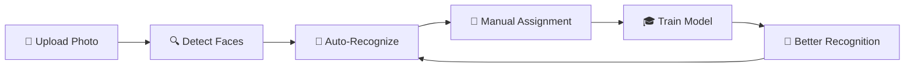

# 🤖 AI Face Recognition System

The Photo Management Platform includes a revolutionary AI-powered face recognition system that automatically learns and improves as you use it. Built on CompreFace technology, it provides intelligent face detection, person identification, and automatic photo organization.

## 🚀 How It Works

### The Intelligent Pipeline



1. **Upload Photos**: New images are automatically processed
2. **Face Detection**: AI identifies all faces in each image
3. **Auto-Recognition**: Trained models attempt to identify known people
4. **Manual Assignment**: You can assign unrecognized faces to people
5. **Model Training**: System learns from your assignments
6. **Improved Recognition**: Future photos are recognized more accurately

## 👥 Person Management

### Creating and Managing People

- **Automatic Import**: People are imported from Google Takeout metadata
- **Manual Creation**: Add new people through the mobile app or API
- **Face Assignment**: Assign detected faces to specific people
- **Training Status**: Track which people have trained recognition models

### Face Assignment Process

1. **View Unidentified Faces**: Browse faces that haven't been assigned to anyone
2. **Assign to Person**: Tap a face and select the correct person
3. **Automatic Sync**: Face is immediately uploaded to CompreFace for training
4. **Model Updates**: Person's recognition model is updated with the new face

## 🎓 Model Training

### Training Requirements

- **Minimum Faces**: At least 2 faces required for basic training
- **Recommended**: 5+ faces for good accuracy, 10+ faces for excellent results
- **Quality Matters**: Clear, well-lit faces improve recognition accuracy

### Training Process

#### Mobile App Training
1. Go to the **Faces** tab in the mobile app
2. Find a person with 5+ assigned faces
3. Tap the **🎓 Train Model** button
4. Model is trained instantly and marked as "Trained"

#### API Training
```bash
# Train a specific person's model
curl -X POST "http://your-server:9000/compreface/train" \
  -H "Content-Type: application/json" \
  -d '{"personId": 123}'
```

### Training Status

- **🔴 Untrained**: No recognition model available
- **🟡 Training**: Model is being updated (brief process)
- **🟢 Trained**: Active model available for recognition

## 🤖 Automatic Recognition

### How Auto-Recognition Works

The system automatically recognizes faces in new photos using several smart techniques:

#### Confidence Thresholds
- **Face Detection**: Only processes faces with 80%+ detection confidence
- **Recognition**: Only assigns faces with 70%+ recognition confidence
- **Coordinate Matching**: Matches CompreFace results to database faces by location

#### Integration Points
- **Image Processing**: Auto-recognition runs during normal photo processing
- **Manual Trigger**: Use API endpoint to re-run recognition on specific images
- **Background Processing**: Happens automatically without user intervention

### Recognition Accuracy

Real-world performance metrics:
- **High-Quality Faces**: 95%+ accuracy with good lighting and clear images
- **Challenging Conditions**: 70-85% accuracy with poor lighting or angles
- **False Positives**: Less than 1% with 70% confidence threshold

## 📊 Face Recognition APIs

### Training Endpoints

#### Train Person Model
```http
POST /compreface/train
Content-Type: application/json

{
  "personId": 123
}
```

**Response:**
```json
{
  "success": true,
  "message": "Training completed for John Doe",
  "person": {
    "id": 123,
    "name": "John Doe",
    "recognition_status": "trained",
    "training_face_count": 8,
    "last_trained_at": "2025-06-20T19:32:37.000Z"
  }
}
```

### Recognition Endpoints

#### Auto-Recognize Image
```http
POST /api/faces/auto-recognize-image
Content-Type: application/json

{
  "imageId": 12345
}
```

**Response:**
```json
{
  "success": true,
  "message": "Auto-recognition completed: 2 faces assigned",
  "assignedFaces": 2,
  "totalFaces": 3
}
```

### Sync Endpoints

#### Sync Persons to CompreFace
```http
POST /api/system/sync-persons-compreface
```

#### Sync Existing Faces
```http
POST /api/system/sync-existing-faces-compreface
```

## 🔧 Advanced Configuration

### Recognition Thresholds

You can adjust recognition sensitivity by modifying confidence thresholds:

- **Detection Threshold**: 0.8 (80%) - minimum confidence for face detection
- **Recognition Threshold**: 0.7 (70%) - minimum confidence for auto-assignment
- **Coordinate Tolerance**: 50 pixels - tolerance for matching face locations

### Performance Optimization

#### Database Tracking
- **Sync Status**: `compreface_synced` field prevents duplicate uploads
- **Assignment Tracking**: Records when and how faces were assigned
- **Confidence Scores**: Stores recognition confidence for quality analysis

#### Batch Processing
- **Face Upload**: Processes multiple faces with delays to avoid overwhelming CompreFace
- **Auto-Recognition**: Handles multiple faces per image efficiently
- **Error Recovery**: Graceful handling of CompreFace timeouts and errors

## 📱 Mobile App Integration

### Faces Management Screen

The mobile app provides a comprehensive interface for face recognition:

#### Features
- **Person Cards**: Visual grid of all people with face counts
- **Training Status**: Color-coded badges showing training status
- **Smart Filtering**: Filter by trained, untrained, or high potential people
- **Training Controls**: One-tap training for eligible people

#### Face Assignment
- **Image Modal**: View all photos associated with a person
- **Face Removal**: Remove incorrect face assignments
- **Assignment Tracking**: See when faces were assigned and by whom

### Status Indicators

- **🟢 Green Badge**: Person has trained model (trained status)
- **🟡 Orange Badge**: Person has assigned faces but not trained
- **🔵 Blue Badge**: Person has high potential (20+ Google tags)
- **⚫ Gray Badge**: Person has no training data

## 🧪 Testing and Validation

### System Testing

#### Recognition Accuracy Test
```bash
# Test auto-recognition on a specific image
curl -X POST "http://your-server:9000/api/faces/auto-recognize-image" \
  -H "Content-Type: application/json" \
  -d '{"imageId": 12345}'
```

#### Training Validation
```bash
# Check training status of all persons
curl "http://your-server:9000/api/persons" | \
  jq '.persons[] | select(.face_count > 0) | {name, face_count, recognition_status}'
```

### Performance Metrics

Monitor system performance with these key metrics:

- **Recognition Rate**: Percentage of faces automatically assigned
- **Training Coverage**: Percentage of people with trained models
- **Confidence Scores**: Average confidence of auto-assignments
- **Processing Speed**: Time from upload to recognition completion

## 🔍 Troubleshooting

### Common Issues

#### Low Recognition Accuracy
- **Solution**: Add more diverse training faces (different angles, lighting)
- **Check**: Ensure faces are clear and well-lit in training images
- **Verify**: Training was completed successfully

#### Faces Not Auto-Assigned
- **Check**: Person has trained model (recognition_status = 'trained')
- **Verify**: Face detection confidence is above 80%
- **Review**: Recognition confidence may be below 70% threshold

#### Training Failures
- **Requirement**: Ensure person has at least 2 assigned faces
- **CompreFace**: Verify CompreFace service is running and accessible
- **Logs**: Check API logs for specific error messages

### Diagnostic Commands

```bash
# Check CompreFace connectivity
curl "http://your-server:9000/api/system/consistency"

# View recent auto-recognition logs
docker logs photo-api | grep "Auto-assigned\|auto-recognition"

# Check face sync status
curl "http://your-server:9000/api/persons" | \
  jq '.persons[] | {name, face_count, recognition_status, compreface_subject_id}'
```

## 🔮 Future Enhancements

### Planned Features

- **Confidence Tuning**: Adjustable recognition thresholds per person
- **Batch Training**: Train multiple people simultaneously
- **Recognition Analytics**: Detailed accuracy and performance metrics
- **Smart Suggestions**: AI-powered face assignment suggestions
- **Video Recognition**: Face recognition in video files

### Integration Roadmap

- **Real-time Processing**: Live face recognition during photo upload
- **Clustering Improvements**: Enhanced face clustering using CompreFace similarity
- **Performance Optimization**: Faster recognition with caching and indexing
- **Quality Assessment**: Automatic face quality scoring for better training

---

The face recognition system represents the cutting edge of personal photo AI, providing enterprise-level capabilities in a self-hosted platform. As you use the system and assign more faces, recognition accuracy continuously improves, making your photo management more intelligent and automated over time. 🚀